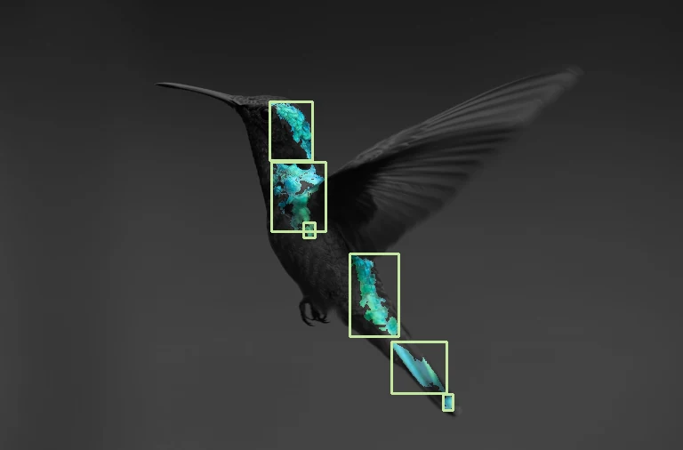

# Computer Vision Lab

Working image-processing, classification, detection, and camera experiments, rebuilt from my 2024 OpenCV and YOLO course projects. The browser lab runs the saved classifiers and alpaca detector alongside image processing, automatic face redaction, and rectangle tracking; the Python tools restore the original training and inference workflows; the native macOS app tracks rectangular surfaces.



## Explore

| Project | What it does | Location |
| --- | --- | --- |
| Image processing | Read, export, crop, resize, threshold, blur, find contours and edges | [Python](python/visionlab/imaging.py), [browser algorithms](web/visionAlgorithms.js) |
| Color tracking | Circular HSV selection and independent connected regions | [Python](python/visionlab/imaging.py), [browser lab](web/VisionLab.jsx) |
| Redaction | Automatic face detection and manual region pixelation in Python and the browser | [Python](python/visionlab/imaging.py), [browser lab](web/VisionLab.jsx) |
| Weather classification | Restore an existing YOLOv8 classifier or train with explicit validation | [CLI](python/visionlab/cli.py) |
| Parking classification | Reproducible SVM with shared preprocessing, duplicate removal, and cross-validation | [Parking pipeline](python/visionlab/parking.py) |
| Alpaca detection | Validate annotations, train, and stream predictions from saved checkpoints | [Dataset configuration](configs/alpaca.yaml) |
| Retinal OCT classification | Correct the archive's “pneumonia” label; validate the actual four-class dataset | [Dataset notes](docs/DATASETS.md) |
| Animal pose | Validate a 39-keypoint dataset before training; archived annotations are missing | [Configuration](configs/animal-pose.yaml) |
| Native webcam tracker | Start/stop camera capture and draw Vision rectangle outlines | [macOS app](native/macos) |

## Browser demo

Use Node 22 or newer:

```sh
npm ci
npm run dev
```

Open the local URL printed by Vite. Use the bundled examples, upload an image, or explicitly enable the camera. All processing stays in the browser. Image processing runs in a Web Worker, inputs are bounded to 768 × 512 pixels, and camera processing is capped at 10 fps. `npm run build` builds the standalone demo; `npm test` runs the algorithm regressions.

The React component is also consumed by the portfolio through a commit-pinned GitHub package:

```jsx
import VisionLab from '@zachshotamartin/computer-vision-lab';

<VisionLab assetBase="/assets/computer-vision/" />
```

Copy `web/assets` into the matching public directory. Camera access requires HTTPS or localhost.

## Python tools

Use Python 3.12 (the verified version) and a virtual environment:

```sh
python -m venv .venv
source .venv/bin/activate
pip install -e '.[models,parking]'
vision-lab --help
vision-lab image /path/to/photo.jpg --mode edges --output output/edges.png
vision-lab track --source 0 --color '#ff0000'
vision-lab redact --source /path/to/photo.jpg --output output/redacted.png
vision-lab train --task classify --data /path/to/weather/data --dry-run
vision-lab predict --model /path/to/best.pt --source /path/to/photo.jpg --imgsz 64 --output output/prediction-1
vision-lab parking --data /path/to/parking/data --limit 300 --model output/parking.joblib
python -m unittest discover -s python/tests -v
```

Install just `pip install -e .` for basic OpenCV operations. The `models` extra adds YOLO; the `parking` extra adds scikit-learn. Original checkpoints and full datasets remain external. Verified browser model exports and small examples are included. Paths with spaces and apostrophes are supported, including during YOLO's final training validation.

## Native macOS app

```sh
sh native/macos/build.sh /path/to/build
open /path/to/build/VisionLab.app
```

Builds with the macOS developer tools. The camera starts only after pressing **Start camera**. Rectangle outlines use Apple Vision and AVFoundation. This is a 2D tracking experiment, not world-anchored AR. Automated validation builds the application without opening a physical camera.

## Organization

```text
python/visionlab/    reusable Python implementation and CLI
python/tests/        input, geometry, dataset, and lifecycle regressions
web/                 React lab, worker, pure algorithms, small demo assets
web/tests/           browser-algorithm unit tests
demo/                standalone browser entry point
native/macos/        native source and independent build script
configs/             portable dataset configuration templates
docs/                repair history, dataset requirements, validation
docs/verification/   actual prediction and training records
scripts/             reproducible archive checks
```

Read [what changed](docs/REPAIRS.md), [dataset requirements](docs/DATASETS.md), and [validation and remaining limitations](docs/VALIDATION.md). The animal-pose archive has no image/keypoint annotations, so training correctly stops before loading a model. The OCT experiment has no clinical validation and needs a separate validation split. No model-accuracy improvement over the old checkpoints is claimed.

These are course-derived explorations with new repair work and a browser implementation. [Upstream attribution](NOTICE.md) is retained. Full datasets, original PyTorch checkpoints, virtual environments, and historical training runs remain outside this repository. The browser-ready model exports, runtime, and representative inputs are included with provenance and licenses.

Reproduce previews with `python scripts/verify-archive.py --archive /path/to/computervision`, followed by `python scripts/build-assets.py --archive /path/to/computervision`.

## Interactive saved models

Open **Trained models** for Weather, Parking, Retinal OCT, and Alpacas. Upload an image or select an example, run the original saved model locally, and export its output. Image tools add **Detect faces** under Region redaction and **Rectangle tracking** for uploaded images or an explicitly started camera. See [browser inference, reproduction, validation, and limits](docs/BROWSER-MODELS.md).
